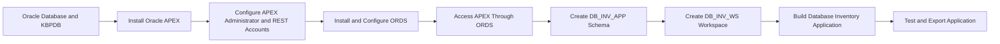

# Oracle APEX and ORDS Installation with a Sample Database Inventory Application

This repository documents the installation and configuration of **Oracle APEX 26.1** and **Oracle REST Data Services (ORDS) 26.2.1** on Oracle Linux. It also demonstrates the high-level Oracle APEX application creation process by building a small **Oracle Database Inventory** application.

The sample application includes:

- An interactive database inventory report
- A create and edit form
- Declarative field validation
- Select lists for database environment and status
- A pie chart grouped by environment
- Dashboard summary cards
- An exported APEX application for reuse

## Environment

| Component | Version or Configuration |
|---|---|
| Operating system | Oracle Linux 9.8 |
| Oracle Database | 23.26.1.0.0 |
| Oracle APEX | 26.1 |
| Oracle REST Data Services | 26.2.1 |
| Java | Oracle JDK 25 |
| ORDS deployment mode | Standalone |
| Target pluggable database | `KBPDB` |
| Sample application schema | `DB_INV_APP` |
| Sample APEX workspace | `DB_INV_WS` |

ORDS 26.2.1 supports Oracle Java 17, 21, and 25. APEX 26.1 requires ORDS 26.1.1 or later.

## Project Flow

## Documentation

The complete procedure is available in:

- [Setup Guide](setup-guide.md)

## Sample Application

The sample application stores basic Oracle Database inventory information.

### Application pages

| Page | Purpose |
|---|---|
| Home | Displays database summary cards |
| Database Inventory | Displays a searchable and filterable interactive report |
| Database Inventory Form | Creates, updates, and deletes inventory records |
| Databases by Environment | Displays a pie chart grouped by environment |

## Expected Outcome

After completing the guide, the environment should provide:

- A valid Oracle APEX installation in `KBPDB`
- ORDS running in standalone mode
- A correctly rendered APEX login page
- An APEX workspace mapped to `DB_INV_APP`
- A functional Database Inventory application
- Working create, read, update, and delete operations
- A chart and dashboard cards based on inventory data
- An exported APEX application SQL file

## Security Notice

This repository uses placeholders for passwords, IP addresses, hostnames, usernames, and email addresses.

## Scope

This project is intended as a practical learning demonstration. It does not cover:

- Production high availability
- Reverse-proxy configuration
- TLS certificate management
- Advanced ORDS connection-pool tuning
- Enterprise authentication
- APEX application security hardening
- Automated deployment pipelines
- Backup and disaster recovery design

## Disclaimer

This guide reflects a lab implementation and should be reviewed against current Oracle documentation before being applied to another environment. Product behavior, supported versions, and recommended installation sequences can change between releases.
